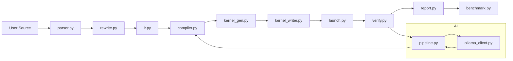

gpukernel_tool — AI GPU Expression Compiler
=========================================

Overview
--------
This repository provides a small AI-driven compiler that turns simple math expressions (or small multi-output programs)
into Triton GPU kernels, verifies correctness against PyTorch, and can use an LLM backend (via Ollama) to iteratively
fix and optimize kernels and BLOCK_SIZE choices.

Architecture (high level)
-------------------------
- Parsing & Validation: [parser.py](parser.py) parses single expressions and multi-output programs into ASTs.
- IR / Lowering: [ir.py], [ir_analysis.py] and related modules convert AST → IR and provide analysis helpers.
- Compiler: [compiler.py] drives expression → IR → Triton kernel generation (single and multi-output).
- Kernel generation: [kernel_gen.py] emits Triton kernel source from IR; [kernel_writer.py] saves/validates kernels.
- Lint / Run / Verify: [kernel_lint.py], [run_kernel.py], [launch.py] run the generated kernels on CUDA + Triton and compare
  outputs with PyTorch reference using [verify.py].
- Self-correcting loop: [pipeline.py] performs compile → lint → run → (LLM fix) → retry for robust compilation.
- AI optimizer: [ai_optimizer.py], [optimizer_plan.py], [prompt_builder.py], and [ollama_client.py] implement
  benchmarking and LLM-guided optimization rounds.
- Benchmarks & reports: [benchmark.py] and [report.py] produce timing reports and speedup graphs.

Architecture Diagram
--------------------

The diagram below shows the main pipeline and how modules interact (parsing, lowering, codegen, verify, and LLM feedback).


```mermaid
flowchart LR
  A[User Source] --> B[parser.py]
  B --> C[rewrite.py]
  C --> D[ir.py]
  D --> E[compiler.py]
  E --> F[kernel_gen.py]
  F --> G[kernel_writer.py]
  G --> H[launch.py]
  H --> I[verify.py]
  I --> J[report.py]
  J --> K[benchmark.py]
  I --> L[pipeline.py]
  L --> M[ollama_client.py]
  M --> L
  L --> E
  subgraph AI
    M
    L
  end
```

Key entry points
----------------
- CLI: `main.py` — interactive entry. Flags: `--benchmark`, `--optimize`, `--n`, `--no-llm`.
- Programmatic:
  - `pipeline.run_pipeline(source, use_llm=...)` — attempt to compile an expression and return a structured result.
  - `ai_optimizer.run_ai_compiler(source, n=..., use_llm=...)` — full compile → benchmark → LLM-optimize flow.

Requirements
------------
- Python 3.10+
- PyTorch with CUDA (to run/verify kernels)
- Triton (Python package) for JIT kernels
- requests (for Ollama client)
- Optional: Ollama local server if you want LLM fixes/optimization (see below)

Quick start
-----------
1. Install dependencies (example):

```powershell
python -m pip install -r requirements.txt
```

If no `requirements.txt` exists, install manually:

```powershell
python -m pip install torch triton requests pytest
```

2. Ensure CUDA drivers are available and `torch.cuda.is_available()` is True.

3. (Optional) Start an Ollama-compatible local server for LLM features. The code posts to http://127.0.0.1:11434/api/chat by default.

4. Run the interactive CLI:

```powershell
python main.py
```

Example input (single expression):

```
x * y + sin(x)
```

Example input (multi-output program):

```
out0 = x * y; out1 = x + y; out2 = x * y + sin(x)
```

Flags
-----
- `--benchmark`: compile, verify, then run autotuned benchmark versus PyTorch.
- `--optimize`: runs the AI optimizer flow (compile → benchmark → LLM rounds → rebenchmark).
- `--n`: tensor size used for benchmarking (default in `config.py`).
- `--no-llm`: skip LLM calls (useful when Ollama not available).

Testing
-------
Run the test suite with pytest:

```powershell
python -m pytest -q
```

Tests come in three tiers:

- **Unit (mocked):** `python -m pytest -m "not kernel and not gpu"`. No GPU, Triton, or Ollama needed; the LLM,
  benchmarks, and CUDA checks are mocked. Network calls from `ollama_client` are blocked in tests.
- **Kernel:** tests marked `kernel` (`test_kernels.py`) compile real Triton kernels, run them, and verify against
  PyTorch. They run on a CUDA GPU, or on the CPU with Triton's interpreter:

  ```bash
  TRITON_INTERPRET=1 python -m pytest -m kernel
  ```

  The interpreter checks correctness, not speed.
- **GPU:** benchmarks marked `gpu`. They need a real CUDA GPU: `python -m pytest -m gpu`.

Tiers that can't run on the current machine are skipped. Every test runs in a temp working directory, so
`kernels/kernel.py` and `reports/` in the repo are never touched.

`TRITON_INTERPRET=1` also works for the CLI (`python main.py --no-llm`), so teammates without an NVIDIA GPU can
compile and verify kernels. Benchmarking still needs a real GPU.

Continuous integration
----------------------
`.github/workflows/ci.yml` runs on every PR and every push to `main`, on GitHub's free runners (no GPU):

1. **unit**: the mocked tests on Python 3.10 and 3.12, with CPU-only torch and no Triton.
2. **kernels**: the kernel tests on the CPU via `TRITON_INTERPRET=1`.

Both jobs also fail if tests leave the working tree dirty. Benchmarks aren't run in CI; run
`python -m pytest -m gpu` on a machine with a GPU when you change performance-related code.

Notes & Troubleshooting
-----------------------
- CUDA (or `TRITON_INTERPRET=1` for CPU) must be available to run kernels and verification. Many modules return helpful RunResult objects when CUDA is missing.
- If using LLM features, ensure an Ollama-compatible API is reachable at the URL in `ollama_client.py`.
- Generated kernels are saved to the `kernels/` folder (`kernels/kernel.py`).


